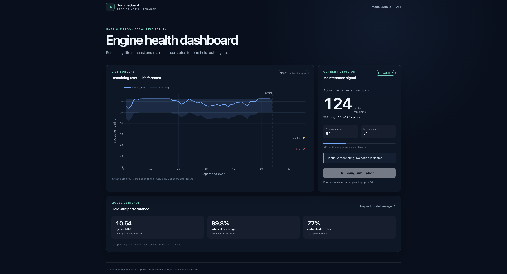
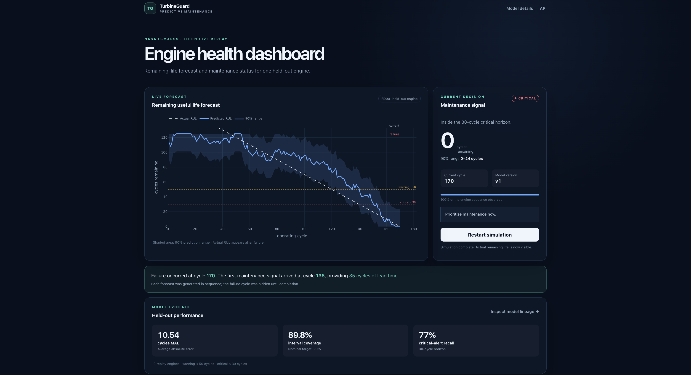
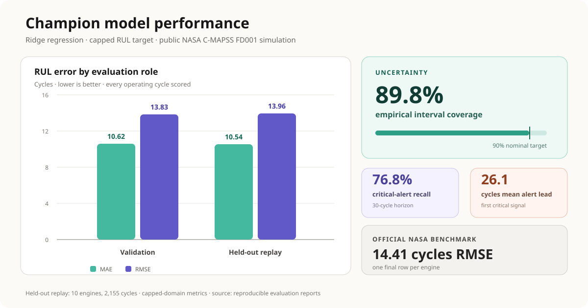

# TurbineGuard

TurbineGuard is an end-to-end predictive-maintenance system that estimates turbine Remaining Useful
Life (RUL) from sensor history and turns those estimates into maintenance-risk alerts. It is built
with the public NASA C-MAPSS FD001 dataset and contains no proprietary data.

[Live demo](https://turbine-guard-web.onrender.com) ·
[Architecture](docs/architecture.md) ·
[Model card](docs/model_card.md) ·
[Runbook](docs/operations.md)





## What it demonstrates

- Reproducible acquisition, validation, feature generation, and model training
- Asset-level train, validation, calibration, and replay splits to prevent leakage
- One feature implementation shared by offline training and online inference
- Explicit model selection, conformal prediction intervals, and MLflow model registration
- FastAPI inference with idempotent ingestion and PostgreSQL persistence
- Held-out trajectory replay with delayed outcomes and online evaluation
- Data-quality, drift, performance, retraining, and guarded promotion workflows
- A containerized local stack and a reduced, immutable public-demo deployment

## Results

Metrics are regenerated from public, simulated NASA data with `make reproduce`. Maintenance costs
are hypothetical normalized units, not currency or claimed savings. See the
[model card](docs/model_card.md) for evaluation details and limitations.

| Metric | Held-out result |
| --- | ---: |
| Champion | Ridge regression (`alpha=1`, RUL capped at 125 cycles) |
| RUL MAE / RMSE | 10.54 / 13.96 cycles |
| 90% conformal interval coverage | 0.898 |
| Critical-alert recall | ~0.77 |
| False alarms | <1 per 1,000 cycles |
| Predictive vs. reactive simulated cost | 64.3% lower in the base scenario |

<!-- Replace this file with a chart exported from the generated evaluation reports. -->


## Architecture

The offline pipeline produces checksummed data, feature, model, and registry artifacts. The online
service uses the same feature builder, loads the champion from MLflow or a pinned deployment bundle,
and stores versioned predictions in PostgreSQL. Replayed failures provide delayed labels for
monitoring and lifecycle decisions.


Nothing reaches serving without passing through the registry, and monitoring returns to the registry
rather than to the live model. Detailed diagrams for splits, training and registration, the serving
request path, champion loading, and the promotion workflow are in
[docs/architecture.md](docs/architecture.md).

## Quickstart

Requirements: Python 3.12 and [uv](https://docs.astral.sh/uv/). Docker is only needed for the full
multi-service stack.

```bash
git clone <repository-url>
cd predictive_maintenance
uv sync
make reproduce
```

`make reproduce` downloads C-MAPSS FD001, validates and converts it to Parquet, builds leakage-safe
features, and trains and evaluates all configured candidates. Generated datasets and artifacts live
under the gitignored `data/` directory.

To inspect all available commands:

```bash
make help
```

## Run the full local stack

A new Docker environment needs one explicit bootstrap to build the artifacts and register the first
champion:

```bash
cp .env.example .env
docker compose build
docker compose up -d --wait postgres mlflow
docker compose --profile bootstrap run --rm bootstrap
docker compose up -d --wait api
```

Open the dashboard at <http://127.0.0.1:8000/>, API documentation at
<http://127.0.0.1:8000/docs>, and MLflow at <http://127.0.0.1:5000>. Subsequent starts can use
`make docker-up`.

See [docs/operations.md](docs/operations.md) for replay, monitoring, configuration, testing, and
shutdown commands.

## Repository structure

```text
src/turbine_guard/
├── data/          acquisition, parsing, validation
├── features/      labels, splits, shared feature builder
├── modeling/      training, calibration, evaluation
├── tracking/      MLflow integration and registry lifecycle
├── api/           inference, health, and dashboard routes
├── database/      operational models and repositories
├── replay/        sensor replay and delayed feedback
└── monitoring/    quality, drift, retraining, promotion
alembic/           PostgreSQL migrations
notebooks/         reproducible exploratory analysis
scripts/           command-line entry points
tests/             unit and PostgreSQL integration tests
```

## Quality checks

```bash
make check
```

The quality gate runs Ruff formatting and linting, mypy, and pytest. CI also exercises PostgreSQL
migrations, integration tests, image contracts, and an end-to-end API smoke test.

## Scope and limitations

C-MAPSS is simulated, its sensor channels are anonymous, and the online feed is a replay of held-out
historical trajectories. TurbineGuard is a technical reference project, not a safety-critical
maintenance product. Read [docs/limitations.md](docs/limitations.md) before interpreting its results.
