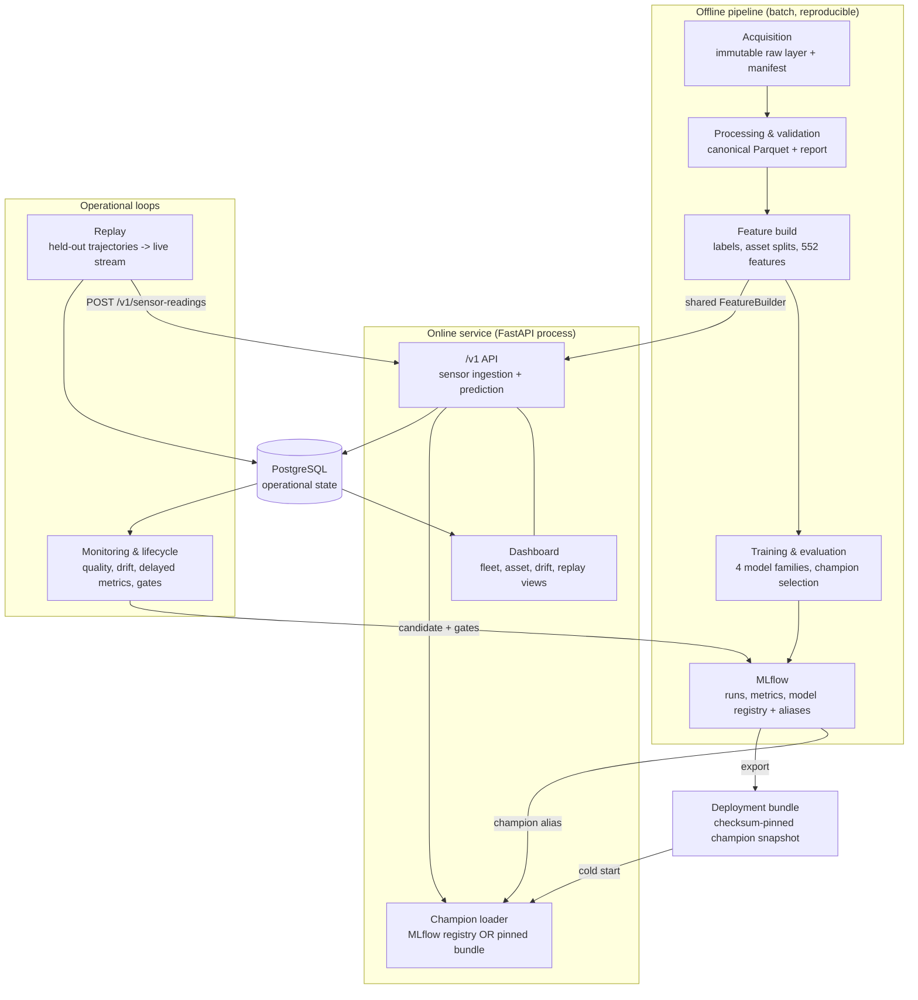

# TurbineGuard Architecture

TurbineGuard is an independently developed predictive-maintenance ML platform inspired by industrial
power-generation use cases. It uses the public NASA C-MAPSS FD001 turbofan degradation dataset and
contains no proprietary client data or implementation details.

This document is the one-page architecture reference: what the components are, how data flows
through them, and how a single online request is served. Deeper per-component contracts live in the
other `docs/` files and the Architecture Decision Records under [docs/adr/](adr/).

## Problem, data, and target

* **Problem.** Predict Remaining Useful Life (RUL) for each engine so that maintenance can be
  planned before failure, and turn continuous RUL predictions into timely warning/critical alerts.
* **Data.** NASA C-MAPSS FD001: 100 training engines run to failure and 100 test engines truncated
  before failure, each a multivariate trajectory of 3 operating settings and 21 anonymous sensors
  sampled per operating cycle. The data is *simulated*; sensor channels are never assigned physical
  meanings.
* **Target.** `RUL = final_cycle − current_cycle`, optionally capped at 125 cycles. The deployed
  champion predicts the capped target.

## Component overview



Key structural properties encoded in this diagram:

* **One shared feature implementation.** The same `FeatureBuilder` produces features for offline
  training and for each online request; there is no separate notebook/serving fork. This is the
  primary defense against training-serving skew.
* **Two interchangeable champion sources.** Locally, the API loads the champion from the MLflow
  registry by alias. In the zero-cost public demo, it loads an immutable, checksum-pinned
  deployment bundle exported from that same registered version — no MLflow process runs publicly,
  so the public registry cannot be mutated. Both implement one `ChampionLoader` protocol and were
  verified to produce identical predictions (max difference 0.0).
* **Leakage boundaries are structural.** Data is split by engine, not by row; replay and
  calibration engines are held out of training; features at cycle `t` depend only on observations
  `≤ t`; and the replay path never exposes the failure cycle to inference.

## Data and control flow (offline → online → feedback)

1. **Acquire.** Download the C-MAPSS archive to an immutable, read-only, checksum-verified raw
   layer and write a provenance manifest.
2. **Process & validate.** Parse the whitespace-delimited files into a typed canonical schema, run
   structural/semantic validation, and publish validated Parquet plus a machine-readable report. A
   failed required check blocks publication.
3. **Feature build.** Generate RUL labels, deterministic asset-level splits (70 train / 15
   validation / 5 calibration / 10 replay), and 552 leakage-safe trailing-window features, with
   split and feature manifests.
4. **Train & select.** Fit four model families (constant baseline, Ridge, histogram gradient
   boosting, XGBoost) over uncapped and capped-125 targets on identical splits. Select the champion
   on validation only, using explicit operational gates and a complexity-tolerance rule. Calibrate
   conformal intervals on the calibration split only.
5. **Track & register.** Log every candidate to MLflow and register the champion with `candidate`,
   `challenger`, `champion` (and later `archived`) aliases, full lineage, and checksums.
6. **Serve.** FastAPI ingests one sensor cycle at a time, rebuilds features through the shared
   builder, predicts point/interval RUL and risk class with the loaded champion, and stores the
   version-pinned prediction in PostgreSQL atomically with the reading.
7. **Replay & delayed feedback.** Held-out engine trajectories are streamed one cycle at a time
   through the real ingestion API. When a trajectory ends, a failure event is emitted, realized RUL
   labels are backfilled for every historical prediction, and delayed evaluations are persisted.
8. **Monitor & retrain.** Data-quality, all-feature drift, and delayed-performance reports run
   against the champion's training-only reference and yield an explicit `no_action` / `monitor` /
   `retrain` / `blocked` decision. Retraining is leakage-safe and reuses the Loop 4 fit path;
   candidates must clear every blocking promotion gate (including MLflow reload equivalence) and,
   by default, human approval before the champion is replaced.

## Serving one online prediction

This is the request path exercised on every `POST /v1/sensor-readings` — including every cycle the
replay loop sends.

```mermaid
sequenceDiagram
    autonumber
    participant Src as Sensor source / replay
    participant API as FastAPI /v1
    participant DB as PostgreSQL
    participant FB as Shared FeatureBuilder
    participant M as Champion (registry alias or pinned bundle)

    Src->>API: POST /v1/sensor-readings (one cycle t)
    API->>API: validate payload (3 settings + 21 sensors, cycle > 0, UTC ts)
    API->>DB: BEGIN; lock/resolve asset; assert cycle contiguous from 1
    alt exact duplicate cycle
        DB-->>API: existing reading + prediction
        API-->>Src: 200 (idempotent replay)
    else conflicting duplicate
        DB-->>API: conflict
        API-->>Src: 409 (never overwrites)
    else new cycle
        API->>DB: read this asset's history <= t
        API->>FB: build features for cycle t (observations <= t only)
        FB-->>API: 552-feature row (order-checked vs manifest)
        API->>M: predict(features)
        M-->>API: point RUL, [lower, upper], risk class
        API->>DB: insert reading + version-pinned prediction (one txn)
        API->>DB: COMMIT
        API-->>Src: 200 { rul, interval, risk, model/run/feature identity, latency }
    end
    Note over API,M: feature or model failure rolls back the whole request
```

The failure cycle and future observations are never available on this path: the replay source
reveals only cycles `≤ t`, and the final cycle is stored only in a replay-state table that no
prediction endpoint reads.

## Deployment topologies

| Concern | Local reference (Docker Compose) | Public demo (zero-cost, ADR 0011) |
| --- | --- | --- |
| API | Container in shared image | One free Render web service |
| Operational DB | PostgreSQL 17 container | External Neon free-tier PostgreSQL |
| Champion source | Live MLflow registry (alias) | Immutable checksum-pinned bundle |
| MLflow service | Runs (SQLite metadata volume) | None (registry mutation impossible) |
| Retraining/promotion | Demonstrable via lifecycle CLI | Read-only snapshot; not available |
| Migrations | One-shot `migrate` service | Alembic at container start |

Both topologies run the identical application image and code; only the champion source and the
presence of the MLflow/retraining plane differ. See
[docs/dashboard_deployment.md](dashboard_deployment.md) and
[docs/containers.md](containers.md) for the full contracts.

## Deliberate non-goals

Kafka, Kubernetes, Spark, a feature store, and a separate frontend framework were considered and
rejected as unnecessary for a single-model, portfolio-scale system; the reasoning and the path to
add them under real load is in [docs/scaling.md](scaling.md). The result is meant to demonstrate
architecture judgment rather than infrastructure accumulation.
